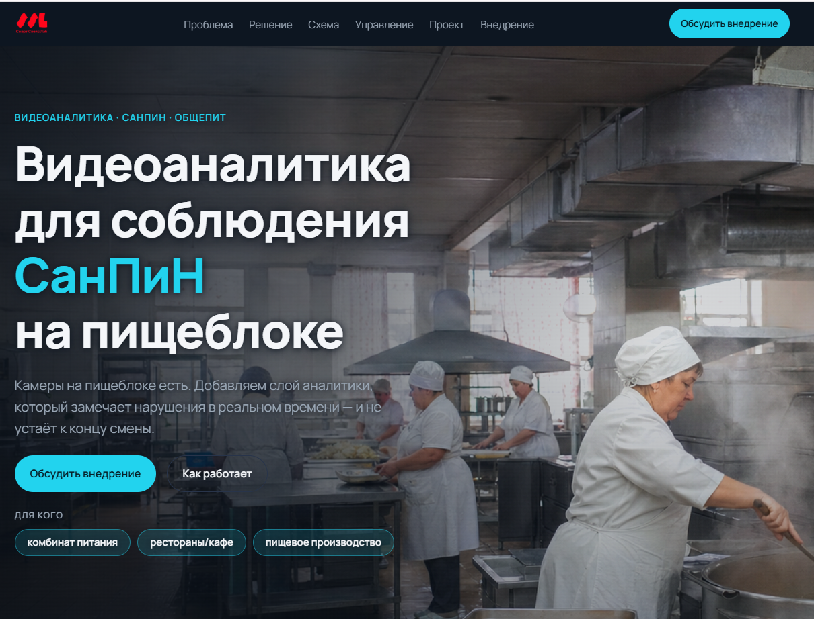
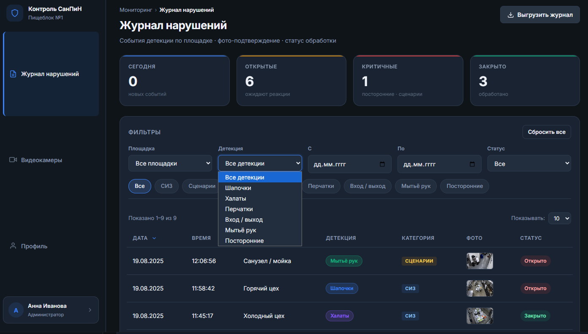
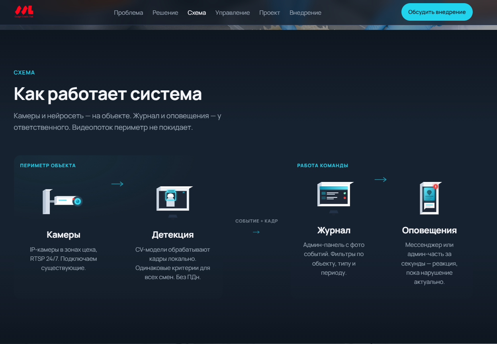

# sanpin-site

Лендинг сервиса видеоаналитики для автоматического контроля соблюдения санитарных норм (СанПиН) на пищевых производствах, в комбинатах питания, ресторанах, кафе и других объектах общепита.

Сайт: [sanpin.ssl-team.com](https://sanpin.ssl-team.com/)

---

## О проекте

Система в реальном времени анализирует поток с камер видеонаблюдения и фиксирует нарушения санитарных режимов — мытьё рук, использование СИЗ, состояние рабочих зон и т. п. Лендинг презентует продукт для B2B-аудитории: владельцев производств, директоров комбинатов питания, заведующих столовыми.

Главная цель страницы — продать программное обеспечение: коротко и выразительно объяснить, что именно делает продукт, какие задачи решает и какой экономический эффект даёт бизнесу.

## Что внутри

- Готовая посадочная страница на чистом HTML/CSS/JS — без сборщиков и зависимостей.
- Адаптивная вёрстка под десктоп, планшет и мобильные устройства.
- SEO-оптимизация: мета-теги, Open Graph, `robots.txt`, канонический URL, фавиконы, `og-cover`.
- Скрипт генерации Open Graph обложки.
- Скрипт генерации фавикона.
- Черновики контента и бренд-гайд в `data/` и `docs/`.
- Готовая сборка `publish/` для деплоя на статический хостинг.

## Стек

- **HTML5** — каркас страниц.
- **CSS3** — стилизация, адаптивность, анимации.
- **Vanilla JavaScript** — интерактив на странице.
- **Python 3** — скрипты генерации ассетов (`scripts/`).

## Дизайн-система

Основные принципы (полный гайд — в `docs/design.md` и `docs/2026-06-14_brand-guide_minimal.md`):

- **Палитра:** глубокий графит / тёмно-синий фон, акцент — холодный cyan / electric blue, текст — белый и светло-серый.
- **Типографика:** Manrope. Заголовки 52–72 px, основной текст 18–20 px с комфортным межстрочным интервалом.
- **Сетка:** ширина контента рассчитана под десктоп 1920×1080, плавно масштабируется до мобильных.
- **Графика:** смысловой центр слайда, контрастный фон с overlay для читаемости.
- **Иконки:** только смысловые inline-SVG.

## Лицензия

Проект разработан для внутреннего использования компании. Условия распространения уточняйте у владельца репозитория.

## Контакты

Вопросы по проекту: владелец репозитория — `vsevolodova` на GitHub.
